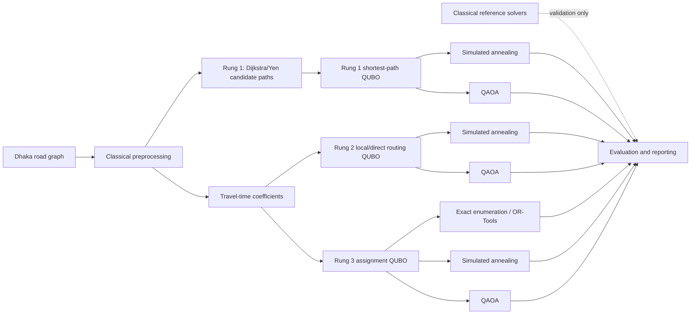
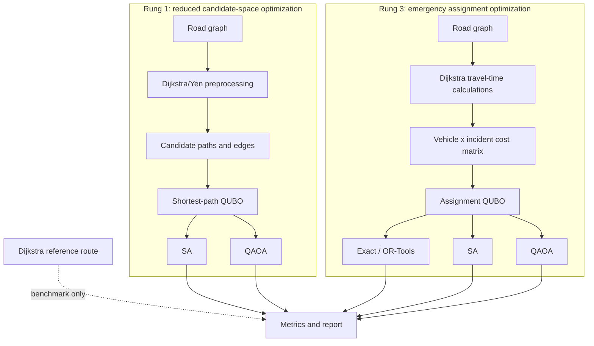

# Quantum Emergency Routing

Quantum-assisted emergency vehicle routing for congested urban roads using QAOA (Quantum Approximate Optimization Algorithm). A research-grade pipeline that takes real road networks (Dhaka city case study), formulates routing problems as QUBOs, and solves them with both classical baselines and QAOA on a local Aer simulator.

## Table of Contents

- [Overview](#overview)
- [Scientific Scope](#scientific-scope)
- [Research Architecture](#research-architecture)
- [Dataset](#dataset)
- [Installation](#installation)
- [Quick Start](#quick-start)
- [CLI Usage](#cli-usage)
- [Configuration](#configuration)
- [Project Structure](#project-structure)
- [Output and Figures](#output-and-figures)
- [Web Application](#web-application)
- [Scientific Independence Audit](#scientific-independence-audit)
- [Interpreting Results](#interpreting-results)
- [Dependencies](#dependencies)
- [License](#license)
- [Citation](#citation)

## Overview

This project implements a three-rung complexity ladder for emergency vehicle routing:

1. **Rung 1 - Shortest Path**: Reduced candidate-space routing between two points
2. **Rung 2 - Local Routing**: Direct edge-variable optimization on a small local graph
3. **Rung 3 - Assignment**: Multiple ambulances assigned to multiple incidents

The repository also retains a TSP formulation as an additional instance-based benchmark. It is not used to describe the primary direct/local Rung 2 study.

## Scientific Scope

### Rung 1: Reduced Candidate-Space Optimization

**CRITICAL**: Rung 1 is **NOT full-network QAOA routing**. It is reduced candidate-space optimization.

- **Candidate generation**: Dijkstra/Yen k-shortest-path preprocessing generates candidate paths and edges
- **QUBO construction**: The QUBO variables correspond to candidate edges only
- **Optimization**: Simulated annealing and QAOA independently optimize the resulting QUBO
- **Methodological limitation**: Routes outside the candidate-path union are not representable by the QUBO
- **Reference solver**: Dijkstra provides the exact baseline on the candidate space
- **No result leakage**: Neither annealing nor QAOA receives the Dijkstra route, bitstring, or objective as input

### Rung 2: Direct Local Graph Optimization

- **Scope**: Small local/direct routing QUBO on bounded-hop instances
- **Optimization**: Direct edge-variable optimization on a local graph
- **Independence**: Classical and quantum solvers receive the same QUBO and optimize independently

### Rung 3: Emergency Assignment Optimization

- **Scope**: Vehicle-by-incident assignment QUBO
- **Preprocessing**: Dijkstra generates travel-time coefficients only
- **Optimization variables**: Assignment decisions $y_{v,c} \in \{0,1\}$
- **Independence**: Exact enumeration, OR-Tools (where enabled), simulated annealing, and QAOA receive the same assignment instance and optimize independently
- **No quantum advantage claim**: The project makes no claim of quantum advantage

## Research Architecture

The project separates network preprocessing, reference computation, QUBO
construction, and optimization. The classical reference result is used for
validation and reporting; it is never copied into an annealing or QAOA result.



### Solver data flow



### Scope by rung

| Rung | Optimization problem | Preprocessing role | Scientific scope |
| --- | --- | --- | --- |
| 1 | Shortest-path edge-selection QUBO | Dijkstra/Yen generates candidate paths and edges | Reduced candidate-space optimization |
| 2 | Small local/direct routing QUBO | Local graph or bounded-hop instance construction | Direct local graph optimization |
| 3 | Vehicle-by-incident assignment QUBO | Dijkstra generates travel-time coefficients only | Independent assignment optimization |

For Rung 1, a route outside the candidate-path union is not representable by
the QUBO. Consequently, Rung 1 results must never be described as
full-network QAOA routing.

For Rung 3, the optimization variables are assignment decisions
$y_{v,c} \in \{0,1\}$. Dijkstra can determine the coefficient associated with
vehicle $v$ serving incident $c$, but it does not determine the assignment.

## Dataset

**Study Area**: Dhanmondi / Kalabagan / New Market, Dhaka, Bangladesh

The road network data is sourced from OpenStreetMap via the OSMnx library. The study area covers approximately 4 km² of central Dhaka, representing a typical congested urban environment with complex road networks.

## Installation

```bash
# Create virtual environment
python -m venv .venv
.venv\Scripts\activate

# Install dependencies
python -m pip install --upgrade pip
python -m pip install -r requirements.txt
python -m pip install -e .
```

## Quick Start

### 1. Fetch Road Network Data
```bash
python scripts/01_fetch_data.py
```
Downloads the Dhaka study area road network from OpenStreetMap and caches it in `data/raw/`. This requires an internet connection only once.

Optional flags:

### 2. Run Classical Baselines
```bash
python scripts/02_classical_baseline.py
```
Runs all classical solvers on all three rungs to establish reference optima and verify QUBO encodings. This must pass before running quantum experiments.

Optional flags:

### 3. Run QAOA Experiments
```bash
python scripts/03_qaoa_experiment.py
```
Runs the full quantum experiment pipeline: classical baselines → QAOA → comparison.

The QAOA result is selected from measured bitstrings. Reported quality should
therefore include feasibility, objective, optimality gap, and $p(\mathrm{opt})$;
an optimal sample with a very small $p(\mathrm{opt})$ is a rare success, not a
reliable optimizer.

Optional flags:

## CLI Usage

After `pip install -e .`, use the `qroute` command:

```bash
qroute info              # Show configuration and paths
qroute fetch              # Download road network
qroute classical          # Run classical baselines
qroute run                # Run full experiment (classical + QAOA)
qroute ladder             # Run all three rungs in order
qroute scan               # Sweep QAOA depth and plot results
```

## Configuration

Edit `config/default.yaml` to customize:

### Key Configuration Options

- **QAOA Settings**:
  - `quantum.reps`: Number of QAOA layers (default: 1)
  - `quantum.optimizer`: Classical optimizer (COBYLA, SPSA, Nelder-Mead)
  - `quantum.maxiter`: Maximum optimization iterations (default: 200)
  - `quantum.shots`: Number of shots per circuit evaluation (default: 4096)
  - `quantum.expectation_mode`: "shots" or "exact"
  - `quantum.max_qubits`: Maximum qubits for QUBO (default: 24)

- **Rung 1 (Shortest Path)**:
  - `rung1.k_paths`: Number of k-shortest-paths for candidate generation (default: 10)
  - `rung1.max_edges`: Maximum candidate edges (default: 40)
  - `rung1.penalty_scale`: QUBO penalty weight for flow conservation (default: 10.0)

- **Annealing Settings**:
  - `annealing.n_restarts`: Number of annealing restarts (default: 20)
  - `annealing.n_sweeps`: Number of sweeps per restart (default: 500)
  - `annealing.seed`: Random seed (default: 42)

- **Data Settings**:
  - `data.bbox`: Geographic bounding box for study area
  - `data.graph_filename`: Name of cached graph file
  - `data.area_name`: Study area name

- **Output Settings**:
  - `output.save_figures`: Whether to generate plots (default: true)
  - `output.save_json`: Whether to save JSON results (default: true)


## Project Structure

```
quantum-emergency-routing/
├── config/
│   ├── default.yaml           # Main configuration file
│   └── dhaka_areas.yaml       # Dhaka area definitions for web app
├── data/
│   ├── raw/                   # Downloaded OSM graphs
│   └── processed/             # Sampled instances
├── scripts/
│   ├── 01_fetch_data.py       # Download road network from OSM
│   ├── 02_classical_baseline.py # Classical solvers (Dijkstra, annealing, bruteforce)
│   ├── 03_qaoa_experiment.py  # QAOA experiments
│   ├── 04_assignment_benchmark.py # Rung 3 p/optimizer/seed matrix
│   ├── 05_noise_study.py       # Noiseless versus Aer noise study
│   ├── 06_paper_figures.py     # Generate paper figures from saved results
│   ├── 07_noise_metrics.py     # Analyze noise study results and generate noise metrics figures
│   ├── 08_rung1_penalty_sweep.py # Penalty scale sweep for Rung 1
│   ├── 09_assignment_figure.py # Generate geometry-aware assignment figure
│   └── interactive_routing.py  # Interactive routing script
├── src/qroute/
│   ├── classical/             # Classical solvers (Dijkstra, annealing, bruteforce)
│   ├── data/                  # OSMnx integration, instance sampling
│   ├── evaluation/            # Metrics, circuit stats, comparison tables
│   ├── quantum/               # QAOA, Hamiltonians, backends
│   ├── qubo/                  # QUBO formulations (shortest path, assignment, TSP)
│   ├── viz/                   # Plotting and visualization
│   ├── cli.py                 # Command-line interface
│   ├── config.py              # Configuration management
│   ├── pipeline.py            # Experiment orchestration
│   └── exceptions.py          # Custom exceptions
├── tests/
│   ├── test_independence_audit.py # First independence audit tests
│   └── test_strong_independence_audit.py # Stronger independence audit tests
├── web_app/
│   ├── app.py                 # Flask web application
│   └── templates/
│       └── index.html         # Web interface
├── results/                   # Experiment outputs and figures
└── requirements.txt           # Python dependencies
```

## Output and Figures

Results are saved in `results/`:

### Generated Figures

The project generates several types of figures for analysis and publication:

1. **Study Area Reference** (`figure_01_study_area_reference.png`): Road network visualization with study area boundaries
2. **Candidate Space Visualization** (`figure_02_rung1_candidate_space.png`): Rung 1 candidate paths and edges on the road network
3. **Rung 1 Quality vs Depth** (`figure_03_rung1_quality_vs_p.png`): QAOA objective quality versus QAOA layers (p)
4. **Rung 1 Feasibility vs Penalty** (`figure_04_rung1_feasibility_vs_penalty.png`): Feasibility rate versus QUBO penalty scale
5. **Rung 1 p(opt) vs Depth** (`figure_05_rung1_popt_vs_p.png`): QAOA optimal-sample probability versus QAOA layers
6. **Qubit/Depth Scaling** (`figure_06_qubit_or_depth_scaling.png`): Circuit depth by QAOA layers
7. **Circuit Resources** (`figure_07_circuit_resources.png`): Two-qubit gates by QAOA layers
8. **Assignment Example** (`figure_08_rung3_assignment_example.png`): Geometry-aware assignment visualization
9. **Assignment Quality** (`figure_09_assignment_quality.png`): Solver comparison for assignment problem
10. **Assignment p(opt)** (`figure_10_assignment_popt.png`): QAOA sampling reliability for assignment
11. **Noise Impact** (`figure_11_noise_impact.png`): Noise model impact on QAOA objective
12. **Noise Probability** (`figure_12_noise_probability.png`): Optimal-solution probability under noise
13. **Noise Feasibility** (`figure_13_noise_feasibility.png`): Feasibility rate under noise
14. **Noise Metrics Summary** (`figure_14_noise_metrics_summary.png`): Combined noise performance metrics

### Figure Generation

Generate all paper figures from saved experiment results:

```bash
python scripts/06_paper_figures.py
```

This script:
- Reads saved JSON/CSV results from `results/`
- Generates publication-quality figures (300 DPI)
- Creates CSV summaries for statistical analysis
- Writes a `figure_manifest.json` documenting data sources

### Noise Study

Run the QAOA noise sensitivity study:

```bash
python scripts/05_noise_study.py
```

This script:
- Compares noiseless and noisy QAOA execution using Qiskit Aer
- Uses depolarizing noise (5% single-qubit, 10% two-qubit) and thermal relaxation
- Runs multiple independent seeds for statistical significance
- Saves results to `results/assignment_noise_study.json`

### Noise Metrics Analysis

Analyze noise study results and generate noise-specific figures:

```bash
python scripts/07_noise_metrics.py
```

This script:
- Loads noise study results from `results/assignment_noise_study.json`
- Computes mean ± standard deviation across independent seeds
- Generates figures for optimal-solution probability, feasibility rate, and combined metrics
- Saves aggregated summary to `results/noise_metrics_summary.json`

### Interactive Routing

Run interactive routing with area selection:

```bash
python scripts/interactive_routing.py
```

Select a Dhaka area (Dhanmondi, Motijheel, Farmgate, Gulistan, Gulshan) and click on the map to set origin/destination points.

## Web Application

A Flask-based web application provides an interactive interface for route computation:

### Starting the Web App

```bash
python web_app/app.py
```

The application runs on `http://localhost:5000`.

### Features

- **Interactive Map**: Select origin and destination points by clicking on the map
- **Area Selection**: Choose from predefined Dhaka areas (Dhanmondi, Motijheel, Farmgate, Gulistan, Gulshan)
- **Solver Comparison**: View results from Dijkstra, simulated annealing, and QAOA
- **Real-time Metrics**: See solver-specific metrics including:
  - Optimization source (exact baseline vs independent solver)
  - Runtime and feasibility
  - QAOA: top sampled states, p(opt), feasibility rate, circuit depth
  - Annealing: restart count, sweep count, hit count
- **Figure Generation**: Automatic generation of analysis figures
- **Optimization Scope Disclosure**: Clear labeling of reduced candidate-space optimization

### Dashboard Metrics

The web app displays:

- **Formulation Info**: Number of variables, candidate edges, candidate paths, optimization type
- **Dijkstra**: Objective, runtime, route, optimization source, optimal flag
- **Annealing**: Objective, runtime, bitstring, solver status, convergence metrics
- **QAOA**: Best sampled objective, p(opt), feasibility, optimizer iterations, top sampled states, circuit depth

**Important**: The dashboard explicitly labels the optimization as "Reduced candidate-space optimization (k-shortest-paths)" to avoid misleading claims about full-network optimization.

## Scientific Independence Audit

The project includes comprehensive independence audit tests to verify solver independence and identify any data leakage.

### Audit Tests

Two test suites are provided:

1. **First Audit** (`tests/test_independence_audit.py`):
   - TEST 1: Log all solver outputs for same instance
   - TEST 2: Random seed independence test
   - TEST 3: Disable Dijkstra after QUBO construction
   - TEST 4: Synthetic graph with alternative optimal route
   - TEST 5: Assertion that QAOA doesn't receive Dijkstra inputs

2. **Stronger Audit** (`tests/test_strong_independence_audit.py`):
   - TEST 3: Trace Python data flow for direct result leakage
   - TEST 4: Adversarial graph with excluded better route
   - TEST 4B: Opposite test with included better route
   - TEST 4: Monkey-patch Dijkstra solver to disable it
   - TEST 5: Verify QAOA actually samples bitstrings
   - TEST 6: Verify annealing actually optimizes QUBO
   - TEST 7: Multiple optimal solutions test

### Running the Audit

```bash
# First audit
python tests/test_independence_audit.py

# Stronger audit
python tests/test_strong_independence_audit.py
```

### Audit Findings

**Classification**: B. Reduced candidate-space independent optimization

**Key Findings**:
- **No direct result leakage**: Neither annealing nor QAOA receives Dijkstra route, bitstring, or objective as input
- **Independent optimization**: Both solvers receive only the QUBO and optimize independently
- **Candidate-space dependency**: The QUBO is built from Dijkstra/Yen k-shortest-paths enumeration
- **Methodological limitation**: Routes outside the candidate-path union cannot be found by QAOA or annealing
- **Actual sampling verified**: QAOA results come from actual measured bitstrings, not copied from Dijkstra
- **Annealing independence**: Annealing performs independent QUBO energy minimization

**Data Flow**:
```
Full graph → Dijkstra/Yen k-shortest-paths → Candidate edges → QUBO → Annealing/QAOA
```

**No leakage path**:
```
Dijkstra result → (NOT passed to) → Annealing/QAOA
```

### Paper Wording

When describing Rung 1 results, use:

> "The QUBO formulation uses a reduced candidate space constructed from the k shortest paths (k=3 default) generated via Yen's algorithm. This is reduced candidate-space optimization, not full-network optimization. The quantum and annealing solvers can only discover routes within this candidate set."

**Do NOT say**:
- "QAOA searched the entire road network"
- "Full-network quantum optimization"
- "QAOA found the global optimum" (without qualifying that it's within the candidate space)

## Interpreting Results

The comparison table shows three key metrics:

1. **feasible**: Did the best sample decode to a valid route?
2. **ratio**: optimum / achieved (1.000 = optimal)
3. **p(opt)**: Fraction of shots that found an optimal solution

A ratio of 1.000 with p(opt) = 0.0005 means the circuit can produce the answer, but needs thousands of shots to see it once.

For Rung 1, compare QAOA and simulated annealing against the candidate-space
reference, while reporting the full-graph Dijkstra route separately. For Rung 3,
exact enumeration or a clearly identified classical reference may be compared
directly with simulated annealing and QAOA because all methods receive the same
assignment instance.

### Rung 3 benchmark matrix

Run the primary assignment experiment across QAOA depth, optimizer, and seed:

```bash
python scripts/04_assignment_benchmark.py \
	--p 1 2 3 4 \
	--optimizers COBYLA SPSA \
	--seeds 41 42 43
```

The command writes JSON and CSV summaries containing the identical assignment
instance, travel-time matrix, exact optimum, SA restart diagnostics, QAOA
sampling statistics, optimality gap, approximation ratio, feasibility rate,
`p(opt)`, runtime, qubit count, circuit depth, and two-qubit gate count.

### Noise study

After exact validation and a noiseless simulator run, compare an Aer noise model
with the same assignment instance:

```bash
python scripts/05_noise_study.py --p 1 --shots 512 --maxiter 30
```

The output records objective degradation, feasibility, `p(opt)`, feasibility
rate, runtime, qubits, depth, and two-qubit gates. Hardware execution is not
automatically attempted. Any future hardware run must first record the backend,
timestamp, logical/physical qubits, mapping, depth, two-qubit gates, execution
time, queue time, and mitigation settings.

### Scientific reporting policy

The figures and benchmark files distinguish correctness, feasibility, solution
quality, sampling reliability, scalability, noise robustness, hardware
feasibility, runtime, and quantum advantage. The project makes no quantum
advantage claim from a single optimal sample or from equal objective values.

## Dependencies

### Core Dependencies

- **Qiskit**: Quantum computing framework for QAOA implementation
- **NetworkX**: Graph algorithms for Dijkstra and shortest-path computations
- **OSMnx**: OpenStreetMap data retrieval and road network processing
- **NumPy**: Numerical computations
- **SciPy**: Scientific computing and optimization
- **Matplotlib**: Plotting and visualization
- **Pandas**: Data manipulation and analysis

### Installation

```bash
python -m pip install -r requirements.txt
```

See `requirements.txt` for the complete list of dependencies with version specifications.

## License

MIT

## Citation

OpenStreetMap data is © OpenStreetMap contributors, ODbL 1.0. Cite it in any write-up that uses these graphs.

### Recommended Citation Format

If you use this code or data in your research, please cite:

```
Quantum Emergency Routing: QAOA-based optimization for urban emergency vehicle routing.
https://github.com/yourusername/quantum-emergency-routing
```

### Acknowledgments

- OpenStreetMap contributors for road network data
- Qiskit team for quantum computing framework
- NetworkX and OSMnx communities for graph processing tools
